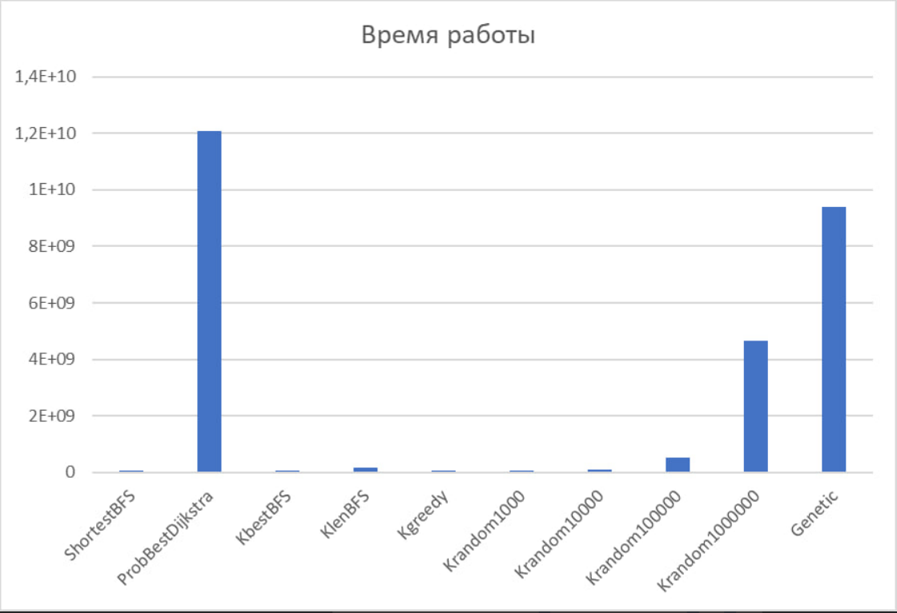
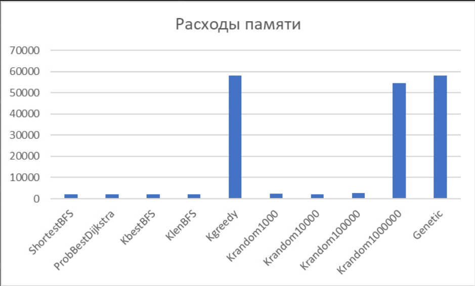
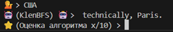

<p align="center">
  
</p>

### NoGPT

[](https://github.com/MadsLorentzen/ai-job-search/actions/workflows/ci.yml)

ИИ с минимальными системными требованиями, который продолжает предложение пользователя.

<p align="center">
  <i>Did this save you a Sunday of cover-letter writing? Consider a coffee.<br>
  Did it land you the job? Maybe two.</i> ☕
</p>

<p align="center">
  <a href="https://ko-fi.com/madslorentzen">
    
  </a>
</p>

### Описание

1. Generator:
- getInt - возвращает случаное число типа int
- getLongLong - возвращает случаное число типа long long
- getProbability - возвращает вещественное число в диапазоне [0;1]

2. Graph:
- В графе вершины - слова, ребро (v, u) - вероятность того, что за словом номер v непосредственно следует слово номер u 
- loadFromFile - загружает граф из текстового файла
- answerTo - отвечает на запрос полльзователя при помощи следующих функций
- Вспомогательные функции:
- toCorrectWords - исправляет опечатки, подбирая наиболее похожие слова
- getStart - найти вершину в графе, которая лучше всего соответствует пользовательскому вводу
- getPathScore - оценка пути с помощью формулы
- pathToSentence - превращает путь в предложение
- Алгоритмы
- findShortestBFS - поиск ближайшего стоп-знака (кратчайшего пути)
- findProbbestDijkstra - поиск пути с максимальной суммарной вероятностью
- findKbestBFS - поиск K кратчайшего пути
- findKlenBFS - поиск пути длины К
- findKrandom - лучший (по формуле) из K случайных предложений
- findKgreedy -  поиск пути длины K жадным алгоритмом
- findGenetic - поиск с помощью генетического алгоритма 

### Структура папок
  ```
  nogpt/
  ├── data/               # Папка для данных
  │   ├── data            # База
  │   └── ...             # Вспомогательные скрипты и exe
  ├── mem_data/           # Папка для данных замеров памяти
  │   └── ...             # csv
  ├── src/                # Папка для исходного кода
  │   ├── Generator.cpp   # Реализация функций класса Generator
  │   ├── Generator.hpp   # Объявление функций класса Generator 
  │   ├── Graph.cpp       # Реализация функций класса Graph
  │   ├── Graph.hpp       # Объявление функций класса Graph
  │   ├── main.cpp        # Точка входа в программу
  │   ├── mem.cpp         # Замеры памяти
  │   ├── time.cpp        # Замеры времени
  │   └── ...             # exe
  ├── statistic/          # Папка для статистики
  │   ├── stat.xlsx       # База данных
  │   └── ...             # Вспомогательные файлы
  ├── time_data/          # Папка для данных замеров времени
  │   └── ...             # csv
  ├── tozip/              # Папка для экспорта первой версии
  │   └── ...             # вспомогательные файлы
  ├── webterm/            # Папка для веб версии
  │   └── ...             # вспомогательные файлы
  └──
  ```

### Установка и запуск

- Браузер
1. Ссылка Степана

- Windows / Mac
1. git clone https://github.com/ArtScienceMK/nogpt
2. Сборка src g++ Generator.cpp Graph.cpp main.cpp -o main.exe 
3. main.exe

- Linux
1. run.sh

### Демонстрация работы

1.
2.
3.

### Технологии (Стек)

1. C++ 20
2. Bash

### Выводы

1. Модель способна давать ответы, демонстрирующее понимание контекста вопроса.
2. Модель обладает минимальными системными требованиями (60 Мб, среднее время ответа 0,06 с.).
3. Предыдущие пункты полностью соответствуют целям, поставленным при планировании проекта.

<p align="center">
  
</p>
<p align="center">
  
</p>

### Бонус
Смешные скрины с начала проекта
<p align="center">
  
</p>
<p align="center">
  
</p>

## License

Apache 2.0
